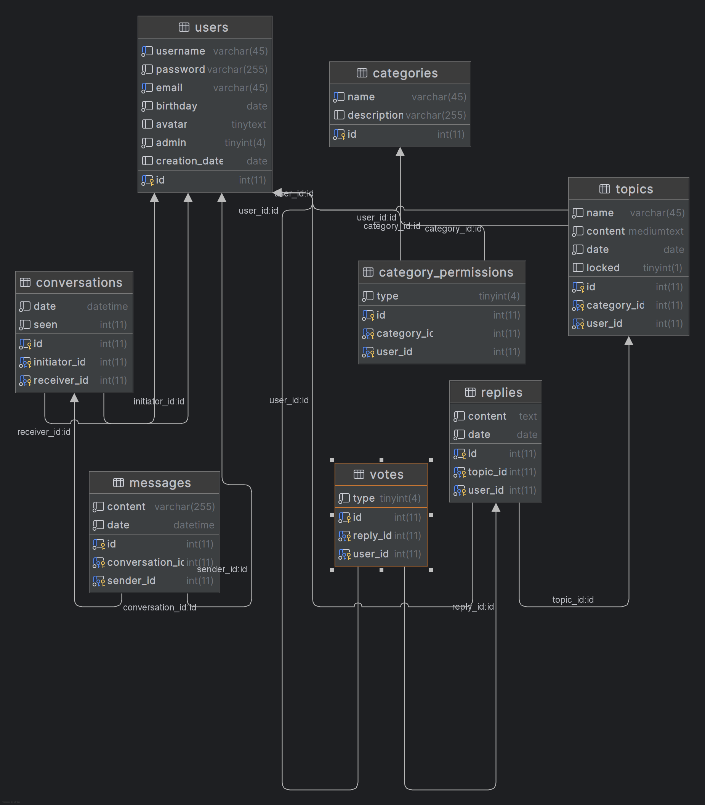

# forum_api

## 📖 Overview
A robust RESTful API backend for a modern forum system, built with **FastAPI** and **MariaDB**. This backend powers the [Forum API Frontend](https://github.com/fcgith/forum_api_front_end) and provides endpoints for user management, authentication, categories, topics, replies, voting, and direct messaging.

---

## 🗄️ Database Schema



**Main Entities:**
- `users`: User accounts, profiles, and roles
- `categories`: Forum categories
- `topics`: Discussion topics within categories
- `replies`: Replies to topics
- `votes`: Voting on replies
- `conversations` & `messages`: Direct messaging between users
- `category_permissions`: User permissions per category

---

## 🚀 Features

- **User Authentication & JWT**
- **User Profiles & Avatars**
- **Category & Topic Management**
- **Replies & Voting System**
- **Direct Messaging (DMs)**
- **Admin & Permissions System**
- **Pagination, Search, and Sorting**

---

## 🛠️ Tech Stack

- **FastAPI** (Python 3.10+)
- **MariaDB** (or MySQL)
- **Pydantic** (data validation)
- **PyJWT** (authentication)
- **Uvicorn** (ASGI server)
- **Docker** (optional, for deployment)

---

## 📋 Installation

1. **Clone the repository**
   ```sh
   git clone https://github.com/fcgith/forum_api.git
   cd forum_api
   ```

2. **Set up a virtual environment**
   ```sh
   python -m venv venv
   venv\Scripts\activate
   ```

3. **Install dependencies**
   ```sh
   pip install -r requirements.txt
   ```

4. **Configure your database**
   - Update `data/connection.py` with your MariaDB credentials.

5. **Run the application**
   ```sh
   python main.py
   ```

---

## 🐳 Docker Deployment

```sh
docker build -t forum-api . 
docker run -p 8000:8000 forum-api
```

---

## 🔗 API Endpoints Overview

### **Authentication**
- `POST /auth/login` — User login (PyJWT)
- `POST /auth/register` — User registration

### **Users**
- `GET /users/` — List all users (admin)
- `GET /users/me` — Public user data of authenticated user
- `GET /users/{user_id}` — Get user by ID
- `GET /users/search/{username}` — Search user by username
- `PUT /users/avatar/` — Update user avatar

### **Categories**
- `GET /categories/` — List all categories
- `GET /categories/{category_id}` — Get category by ID
- `GET /categories/{category_id}/topics` — List topics in category
- `POST /categories/add` — Create category
- `PUT /categories/update-hide-status` — Hide/unhide category
- `PUT /categories/update-user-permissions` — Update user permissions
- `GET /categories/{category_id}/get-users-with-permissions` — List users with permissions
- `GET /categories/{category_id}/check-permission` — Check user permission
- `PUT /categories/{category_id}/lock` — Lock category

### **Topics**
- `POST /topics/` — Create topic
- `GET /topics/` — List topics (with search, sort, pagination)
- `GET /topics/{topic_id}` — Get topic by ID
- `GET /topics/{topic_id}/replies` — List replies for topic
- `PUT /topics/{topic_id}/lock` — Lock topic

### **Replies**
- `POST /replies/{topic_id}` — Add reply to topic
- `PUT /replies/best/{topic_id}/{reply_id}` — Mark reply as best
- `PUT /replies/vote/{reply_id}` — Vote on reply
- `GET /replies/vote/{reply_id}` — Get user's vote on reply

### **Conversations & Messages**
- `GET /conversations/` — List user's conversations
- `GET /conversations/last-message/{user_id}` — Last message with user
- `POST /conversations/messages/` — Send message
- `GET /conversations/{conversation_id}` — Get messages in conversation
- `GET /conversations/msg/{user_id}` — Get messages between two users

---

## 📁 Project Structure

```
forum_api/
├── routers/         # API route definitions
├── services/        # Business logic
├── models/          # Pydantic models
├── repo/            # Database access
├── data/            # DB connection/config
├── sql/             # SQL scripts
├── tests/           # Unit tests
├── main.py          # FastAPI app entrypoint
├── requirements.txt # Python dependencies
└── Dockerfile       # Docker config
```

---

## 👥 Authors

- fcgith - Steliyan Slavov
- gosho359 - Georgi Yovchev
- martin-kitukov - Martin Kitukov

---

## 🙏 Acknowledgments

- Special thanks to the entire team at TelerikAcademy :)

---


## 🔗 Links


- [Live Demo](http://172.245.56.116:8080/)
